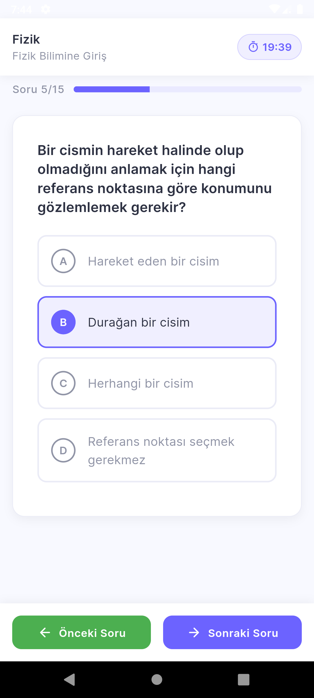

# ZozoNEXT
ZozoNEXT, öğretmenler ve öğrenciler için tasarlanmış, yapay zeka destekli bir eğitim asistanı mobil uygulamasıdır. Bu platform, kullanıcıların ders planları oluşturmasını, online sınavlar yapmasını, performans analizleri gerçekleştirmesini ve daha fazlasını sağlamak amacıyla tasarlanmıştır. Uygulama, Google Generative AI (Gemini) yapay zeka desteği ile öğrenme ve öğretme süreçlerini daha verimli hale getirmeyi hedefler.

## Özellikler
### Öğretmen Modülü
- **Ders Planı Oluştur**: Öğretmenler, ders, sınıf ve konu bilgilerini girerek yapay zeka desteğiyle ders planı oluşturabilir, düzenleyebilir ve PDF olarak indirebilir.
- **Yazılı Sınav Hazırla**: Ders, sınıf, konu, zorluk seviyesi ve sınav süresi gibi bilgileri girerek yapay zeka tarafından yazılı sınav oluşturabilir ve PDF olarak indirebilir.
- **Quiz Oluştur**: Konu bazlı online quiz sınavları oluşturabilir ve öğrencilere sunabilir.
- **Performans Analizi**: Öğrencilerin sınav performanslarını (doğru, yanlış, boş sayısı, başarı yüzdesi vb.) analiz edebilir.
- **Ders Programı**: Takvim modülü üzerinden ders programlarını planlayabilir.
- **AI Asistan**: Zozo (Gemini destekli) yapay zeka asistanı ile sohbet edebilir ve yardım alabilir.

### Öğrenci Modülü
- **Online Sınavlar**: Öğretmenlerin yayınladığı online sınavları çözebilir.
- **Performansım**: Çözülen sınavlardan elde edilen sonuçları grafiksel olarak görüntüleyebilir.
- **Yazılı Sınavlarım**: Yazılı sınav takvimini takip edebilir ve sınava ne kadar süre kaldığını görebilir.
- **AI Asistan**: Zozo yapay zeka asistanı ile destek alabilir.
- **Anasayfa - Çalışma Önerileri**: Başarı oranı düşük konularda kişiye özel öneriler alarak eksikliklerini giderebilir.

## Kullanılan Teknolojiler
- **Front-End**: Flutter
- **Back-End**: Dart
- **Database**: Firebase Firestore Database
- **Authentication**: Firebase Authentication
- **State Management**: Riverpod
- **Grafik**: fl_chart
- **Takvim**: syncfusion_flutter_calendar
- **Yapay Zeka**: Google Generative AI (Gemini)

## Kurulum
1. **Flutter SDK** ve **Dart** dilini kurun.
2. Firebase projesi oluşturup gerekli Firebase hizmetlerini (Firestore, Authentication) etkinleştirin.
3. Projeyi klonlayın:

   ```bash
   git clone https://github.com/kullaniciadi/ZozoNEXT.git
   cd ZozoNEXT
   ```

4. Gerekli bağımlılıkları yükleyin:

   ```bash
   flutter pub get
   ```

5. Firebase yapılandırmasını ekleyin. (Bunla ilgili youtube'de öğretici videolar var. Onları izleyebilirsiniz. O videoda yapılacak adımlar sayesinde otomatik olarak Firebase Console’dan `google-services.json` dosyasını `android/app` klasörüne ekler ve lib klasörü altına firebase_options.dart dosyası oluşturur.)

6. Uygulamayı başlatın:

   ```bash
   flutter run
   ```

## Kullanım
Uygulamada, öğretmenler ve öğrenciler farklı kullanıcı profilleri ile giriş yapabilirler. Öğretmenler ders planı oluşturabilir, yazılı sınavlar hazırlayabilir ve öğrenci performansını analiz edebilirken; öğrenciler ise sınavlara katılabilir, performanslarını takip edebilir ve Zozo asistanı ile eksiklerini giderebilirler.

## Ekran Görüntüleri

<table>
  <tr>
    <td>1</td>
     <td>2</td>
     <td>3</td>  
  <tr>
    <td></td>
    <td></td>
    <td></td>   
 </table>

<table>
  <tr>
    <td>4</td>
     <td>5</td>
     <td>6</td> 
  <tr>
    <td></td>
    <td></td>
    <td></td>
 </table>
  
<table>
  <tr>
    <td>7</td>
     <td>8</td>
     <td>9</td> 
  <tr>
    <td></td>
    <td></td>
    <td></td>
 </table>

 <table>
  <tr>
    <td>10</td>
     <td>11</td>
     <td>12</td> 
  <tr>
    <td></td>
    <td></td>
    <td></td>
 </table>

 <table>
  <tr>
    <td>13</td>
     <td>14</td>
     <td>15</td> 
  <tr>
    <td></td>
    <td></td>
    <td></td>
 </table>

 <table>
  <tr>
    <td>16</td>
     <td>17</td>
     <td>18</td> 
  <tr>
    <td></td>
    <td></td>
    <td></td>
 </table>

 <table>
  <tr>
    <td>19</td>
     <td>20</td>
     <td>21</td> 
  <tr>
    <td></td>
    <td></td>
    <td></td>
 </table>


## İletişim
Herhangi bir sorunuz veya geri bildiriminiz varsa, lütfen e-posta ile iletişime geçin: [hsyn.kbulut@gmail.com](mailto:hsyn.kbulut@gmail.com)